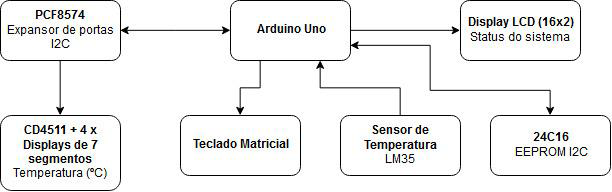
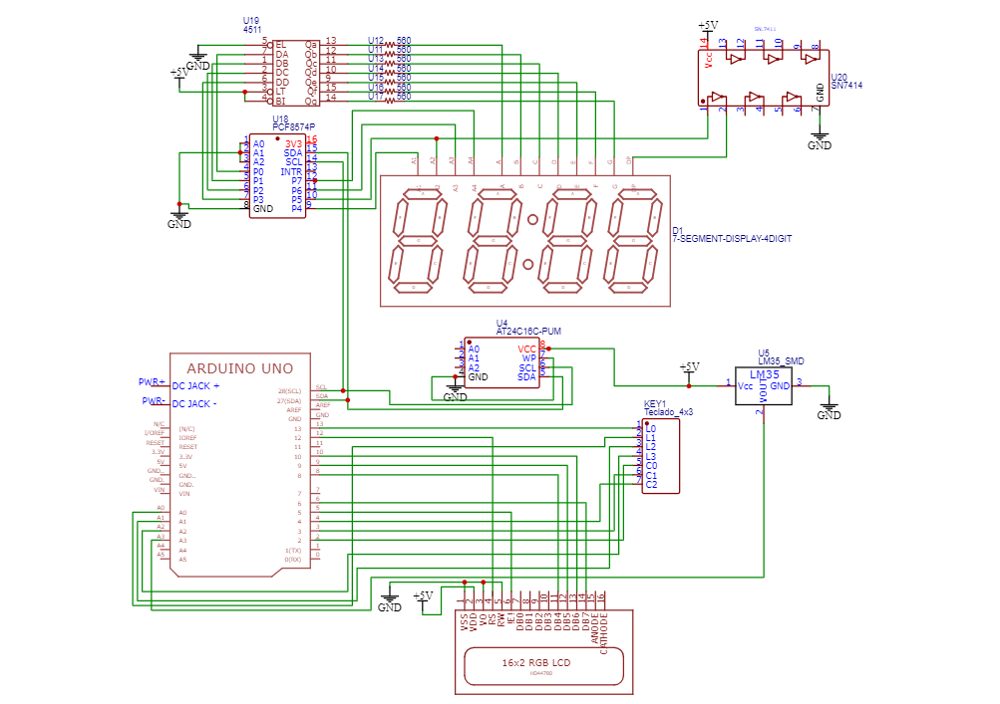
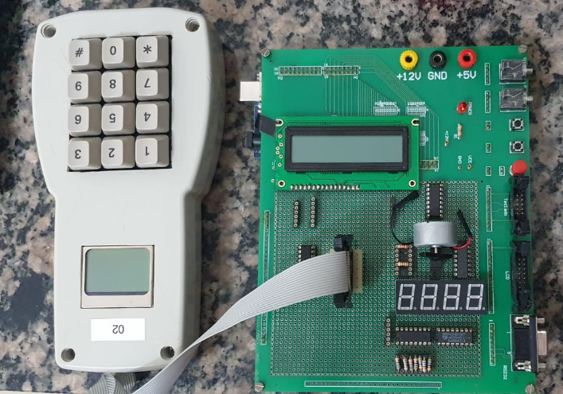

# Data logger de temperatura

## Objetivo

Essa atividade foi desenvolvida para explorar as principais funcionalidades do microcontrolador ATMEGA128p. Ela foi realizada através de um arduino, uma vez que facilita a comunicação entre alguns componentes,  mas também poderia ser desenvolvida partindo do microcontrolador, através de um projeto melhor elaborado. As principais funcionalidades exploradas foram:
- Comunicação I2C;
- Funcionamento de rotinas de interrupção;
- Desenvolvimento com temporizadores;
- Transdutor de temperatura;
- Multiplexação de Displays;
- Teclado Matricial;
- Utilização de memória ROM.

## Funcionalidades

Este projeto se trata de um data logger, com a capacidade de coletar temperatura do ambiente, e armazenar na memória ROM. Os comandos dependem, majoritariamente, do teclado matricial e do display LCD. Abaixo é possível visualizar o diagrama de bloco e o esquemático do sistema, que detalham a comunicação entre os módulos.

  
  
Diagrama de blocos

Esquemático do sistema

  

Placa de montagem

A tabela abaixo exibe as opções de comandos. Caso algum comando não seja possível, o erro será tratado e o usuário é informado. Um comando é enviado quando pressionada a tecla "#", e apagado quando pressionado a tecla "*".

| Comando | Função| Resposta |
| ---  | ---  | --- |
| 1 | Reset | Apaga toda a memória, com aviso no display |
| 2 | Ocupação | Mostra no display o número de dados gravados e o número de medições disponíveis |
| 3 | Iniciar coleta | Mostra mensagem de coleta iniciada no display |
| 4 | Finalizar coleta| Mostra mensagem de coleta finalizada no display |
| 5 | Transferir dados | Envia pela porta serial os dados coletados, mostrando mensagem do andamento da transferência ("i de N...") no display LCD. |

Tabela de comandos

